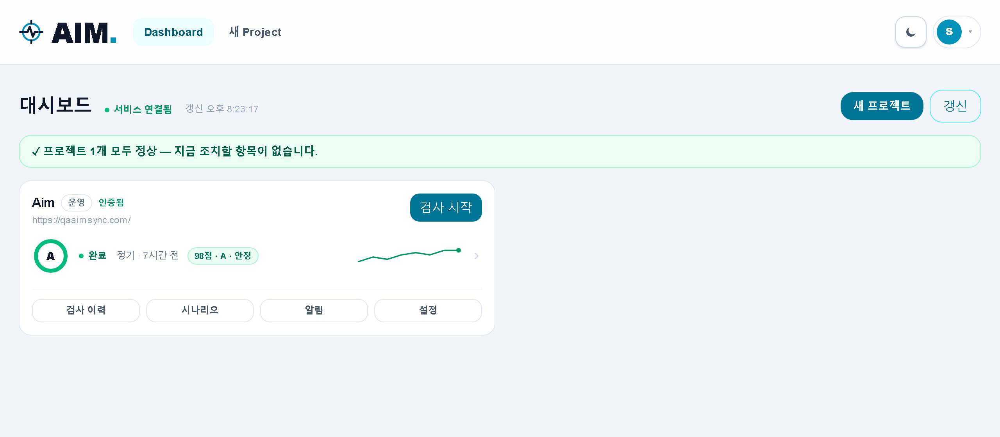
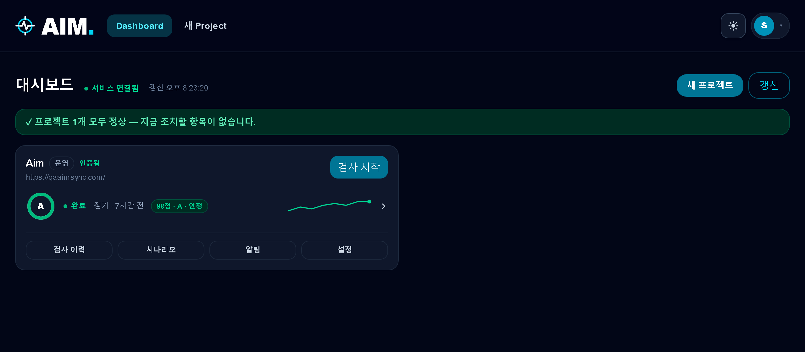
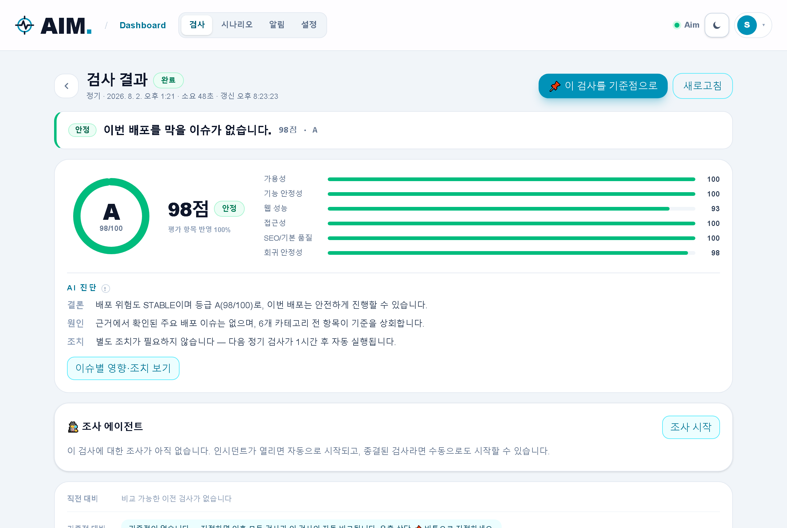
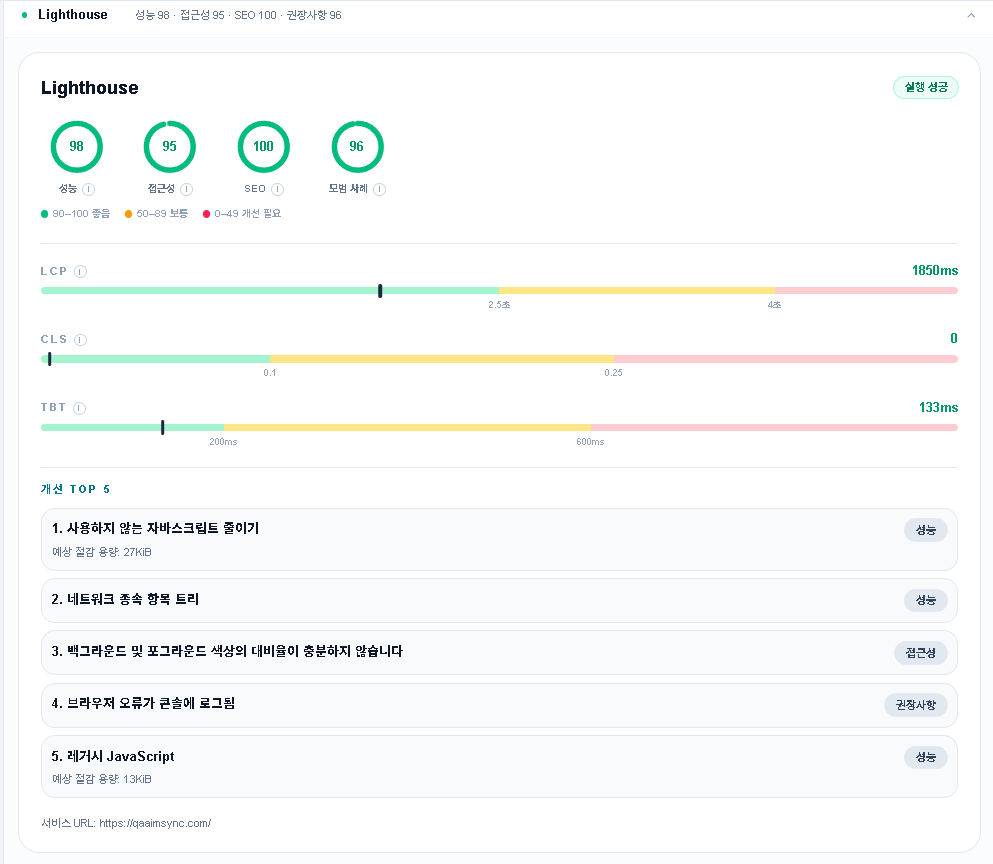
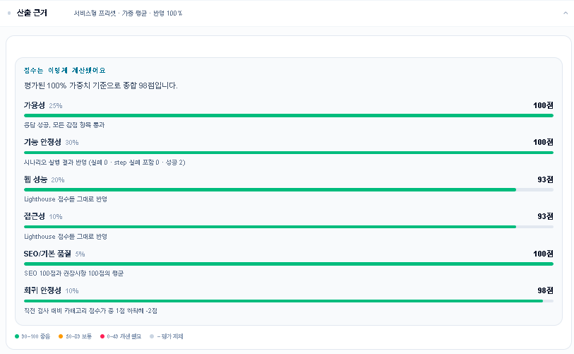
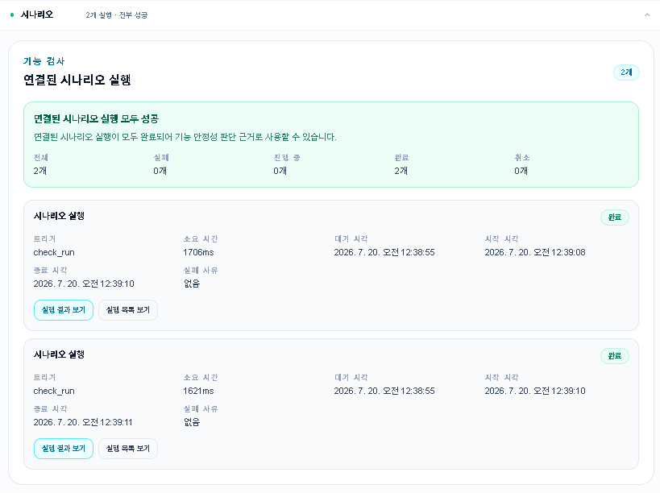
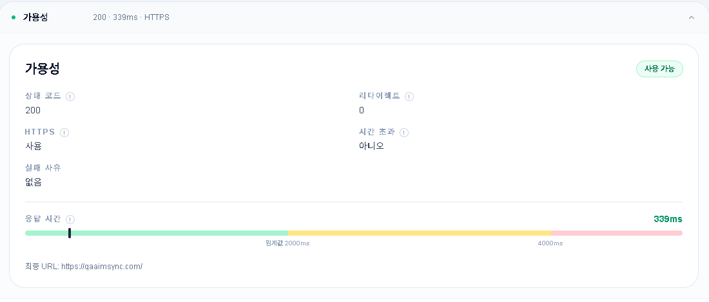
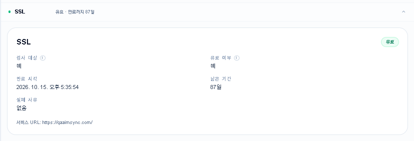

<p align="center">
  
</p>

# AIM — AI Quality Monitor

> **"이번 배포, 이전보다 정말 나아졌을까?"**
> 배포 후 웹서비스의 품질 변화를 근거 기반으로 판단해주는 AI 품질 모니터링 플랫폼

[](https://github.com/Shin-H-S/AIM/actions/workflows/ci.yml)


**🔗 라이브 데모**: [qaaimsync.com](https://qaaimsync.com)

> 🕵️ **조사 에이전트 운영 중**: 인시던트가 열리면 도구 루프로 검사 결과·시나리오·아티팩트를
> 직접 조사해 원인을 7유형으로 분류하고 조치를 제안하는 LLM 에이전트가 자동으로 붙습니다.
> 평가부터 먼저 — 실측 사고를 포함한 [평가셋 210건과 채점기](apps/worker/src/aim_worker/agent/)로
> 승격 게이트(미공개 test 83건 정확도 100% · 위험 방향 오분류 0건)를 통과했고, 격리 실험대(lab)에서
> **다운·지연·UI 회귀·시나리오 스테일·SSL 5개 유형 전부를 실제 장애로 정판정** 검증했습니다.
> 실패 스크린샷은 vision 증거로 판별 호출에 동봉되고, LLM 예산 서킷브레이커와 규칙 폴백이
> 있어 비용 상한과 무관하게 조사는 항상 종결됩니다.

## 개발 목적

1인 개발자와 초기 팀은 전담 QA 없이 배포합니다. uptime 체커는 "죽었는지"만 알려줄 뿐,
**성능이 퇴보했는지, 핵심 사용자 흐름이 깨졌는지, 이전 배포 대비 회귀가 있는지**는 알려주지 않습니다.

AIM은 이 간극을 메우기 위해 만들었습니다.

- 검사 하나로 **가용성 · SSL · 웹 성능(Lighthouse) · 핵심 사용자 흐름(Playwright)** 을 함께 측정
- 결과를 **결정론적 점수와 등급**으로 환산하고, 이전 실행·베이스라인과 **자동 비교**
- 수집된 근거만으로 **AI가 원인과 조치를 한국어로 진단** — 추측이 아닌 evidence 기반

기술적으로는 비동기 파이프라인 설계, 브라우저 자동화, LLM 통합, CI 배포 연동, 단일 VM 운영까지
**프로덕션 서비스의 전체 수명주기를 혼자 완주**하는 프로젝트입니다. 현재 자체 도메인에서
HTTPS로 실서비스 중이며, **AIM 자신을 첫 프로젝트로 등록해 스스로를 모니터링**합니다.

## 핵심 기능

| 기능 | 설명 |
|---|---|
| 🔍 **통합 검사 (CheckRun)** | HTTP 가용성, SSL 인증서, Lighthouse 모바일 스캔, Playwright 시나리오를 한 번에 실행 |
| 🎭 **사용자 흐름 테스트** | navigate/click/fill/assert 등 8종 step으로 핵심 흐름을 정의, 실패 시 스크린샷·콘솔·네트워크 근거 자동 수집 |
| 📊 **결정론적 스코어링** | 6개 카테고리(가용성·기능 안정성·성능·접근성·SEO·회귀 안정성) 가중 평균 + risk gate, 산출 근거까지 저장 |
| 📈 **회귀 감지** | 직전 실행·지정 베이스라인 대비 점수/성능/응답시간 변화 추적, 대시보드 추이 차트 |
| 🤖 **AI 진단 리포트** | Claude API가 수집 근거만으로 요약·이슈 영향·권장 조치를 생성, 이슈마다 근거 링크 연결 |
| 🕵️ **조사 에이전트** | 인시던트에 자동으로 붙어 원인을 7유형으로 판별 — 확정 신호는 규칙이 즉시 결론, 애매한 실패만 LLM 판별(실패 스크린샷 vision 증거 동봉), 조사당 재검사 1회로 일시 현상 배제 |
| ⏰ **정기 스캔 & 알림** | Celery Beat 주기 스캔(프로젝트별 opt-in), incident 감지와 Slack/Discord webhook·이메일(opt-in) 알림 |
| 🚀 **배포 연동 (Deploy hook)** | 프로젝트 스코프 API 토큰으로 CI가 배포 직후 검사를 자동 트리거, 커밋 SHA 추적 |

## 사용 기술

| 영역 | 스택 |
|---|---|
| **Backend** | Python 3.12, FastAPI, SQLAlchemy, Alembic, Pydantic, PyJWT + Argon2 |
| **Worker** | Celery + Redis, Playwright(Chromium), Lighthouse CLI |
| **Frontend** | Next.js 16 (App Router), React 19, TypeScript (strict), Tailwind CSS 4 |
| **AI** | Anthropic Claude API — structured output, deterministic fallback |
| **Data** | PostgreSQL, Redis |
| **Infra** | Docker Compose, Caddy, Oracle Cloud Ampere A1(ARM) 단일 VM, GitHub Actions CI |
| **품질** | ruff · mypy · pytest(커버리지 게이트) / ESLint · Vitest · TS strict / Playwright E2E — 테스트 778건, CI 4종 게이트 |

## 아키텍처

```text
 git push ─▶ CI (GitHub Actions) ─▶ deploy hook (프로젝트 토큰 + 커밋 SHA) ─▶ 검사 자동 시작

                    ┌────────────────── Oracle A1 VM (Docker Compose) ─┐
 사용자 ── Caddy ──┤  Web (Next.js) ── API (FastAPI) ──┬── PostgreSQL  │
   (HTTPS 자동)     │                                   ├── Redis ──┐   │
                    │  Beat (정기 검사 스케줄러) ────────┘           │   │
                    │  Worker (Celery) ◄────────────────────────────┘   │
                    │    ├─ availability / SSL / Lighthouse 스캔        │
                    │    ├─ Playwright 시나리오 실행                    │
                    │    ├─ 스코어링 → 회귀 비교 → AI 리포트 생성       │
                    │    └─ 장애 감지/복구 ─▶ Slack·Discord·이메일 알림 │
                    │  Worker-Agent (조사 전용 큐) ─ 인시던트 원인 판별      │
                    └───────────────────────────────────────────────────┘
```

**검사 흐름**: 트리거 3종(수동 버튼 · 정기 스케줄 · **배포 훅**) → 큐 등록 → Worker가
스캔·시나리오 실행 → 결과 정규화 저장 → 점수/위험도 계산 → 직전·기준점 비교 →
장애 감지 시 webhook/이메일 알림 → AI 진단 리포트 생성 → 웹 표시

## 기술적 특징

**1. LLM은 서술만, 판단은 코드가**
점수·등급·deployment risk·이슈 목록은 전부 결정론적으로 계산하고, LLM은 그 위에 한국어 서술만 입힙니다.
LLM이 점수나 이슈를 바꿀 수 없고, API 키가 없거나 호출이 실패해도 결정론적 서술로 폴백해
**리포트 생성 자체는 절대 실패하지 않습니다.** 사용된 생성기는 DB에 기록해 추적합니다.

**2. SSRF-safe 설계**
사용자가 입력한 URL로 서버가 요청을 보내는 구조라 SSRF 방어를 전 구간에 넣었습니다.
DNS 해석 결과의 private/link-local/metadata IP 차단, redirect 목적지 재검증,
Playwright 브라우저의 아웃바운드 요청 검증, evidence 저장 전 토큰·비밀번호 마스킹까지 적용했습니다.

**3. 비동기 파이프라인의 정합성**
ScenarioRun이 CheckRun보다 늦게 끝나는 경합 상황에서 점수·비교·incident·AI 리포트를 재계산하는
재수렴 로직, 큐 등록 실패 시 FAILED 마킹, 중복 정기 스캔 방지(active run 가드) 등
**분산 작업의 순서가 뒤섞여도 결과가 일관되도록** 설계했습니다.

**4. 근거 기반 진단**
AI 리포트의 모든 이슈는 수집된 evidence(스캔 결과, 실패 스크린샷, 콘솔 에러, 네트워크 실패)를
참조하며, 웹 UI에서 이슈의 근거 링크를 누르면 해당 결과 카드로 바로 이동합니다.

**5. 최소 권한 배포 토큰**
CI가 쓰는 배포 훅 토큰은 **DB에 sha256 해시만 저장**하고 원문은 발급 응답에서 1회만 노출합니다.
권한은 "해당 프로젝트의 검사 시작" 하나로 좁혀 유출 시 피해 반경을 최소화했고, 즉시 폐기(revoke)와
마지막 사용 시각 추적을 지원합니다. 훅은 활성 검사 중복 호출을 409로 거절해 큐 적체를 막습니다.

**6. 운영으로 증명**
Caddy 자동 HTTPS 위에 감시를 세 겹으로 둡니다 — VM 안의 디스크·스왑 경보, /metrics 기반
서비스 경보(검사 큐 정체 · 스케줄러 심장박동 · 인시던트), 그리고 VM이 통째로 죽는 경우를 잡는
GitHub Actions 외부 프로브. 백업은 일일 DB 덤프·주간 아티팩트의 오프박스 사본(쓰기 전용
사전 인증 URL) + 주간 부트 볼륨 백업 + 시크릿 번들의 암호화 오프박스 사본까지이고,
**복원 리허설을 원커맨드·자동 판정으로 만들어 실백업으로 정기 검증**합니다.
GCP → Oracle Cloud 이전도 이 런북으로 수행했습니다.

**7. 브라우저 세션은 httpOnly 쿠키로**
액세스 토큰을 localStorage에서 걷어내 XSS 토큰 탈취 표면을 원천 제거했습니다.
double-submit CSRF(SameSite=Lax + csrf 쿠키↔헤더 일치)로 위조를 막고, 활동 중인 세션은
서버가 응답에 쿠키를 다시 실어 조용히 연장합니다(sliding session). 스크립트·배포 훅이 쓰는
Bearer 경로는 CSRF 면역이므로 그대로 유지 — 전환 전에 Playwright E2E를 안전망으로 먼저
깔고 진행해, 인증 경로를 갈아엎는 작업이 회귀 없이 끝났습니다.

**8. 결함을 잡는 실험대 (dogfooding lab)**
실사용자가 있는 운영을 고의로 깨뜨릴 수 없어, 별도 서브도메인의 격리 실험대에서 실제 장애
(UI 파손 · 폼 이사 · 인증서 파괴)를 일으켜 에이전트를 검증합니다. 합성 평가셋 100%가 놓친
결함을 이 실험대가 두 번 잡았습니다 — "없는 증거를 인용하는 판정"과 "인증서가 깨지면
정작 SSL 검사가 건너뛰어지는 파이프라인 게이트"는 모두 실험 첫 가동에서 드러나 수정됐습니다.

**9. 판정 중심 UX**
모든 화면의 첫 블록이 "배포해도 되는가 / 조치가 필요한가"에 답하도록 설계했습니다 — 결과 화면의
판정 헤더(에이전트 결론 병합), 대시보드의 조치 스트립, 인시던트의 생애 타임라인(발생 → 조사 → 해소).
빈 상태는 한 줄로 접고 문제가 커질 때만 화면을 씁니다. 이 리디자인의 합격 판정도 AIM 자신이 내렸습니다 —
**자기 측정 접근성 93 → 100**, 성능 무회귀.

## 화면

**대시보드 (관제판)** — 최상단 "지금 조치 필요" 스트립이 인시던트·검사 실패·인증 대기를 심각도순으로
띄우고(없으면 "모두 정상" 한 줄), 프로젝트 카드는 상태별 주 행동 하나와 온보딩 체크리스트를 보여줍니다



**다크 모드** — 시스템 설정 연동 + 헤더 토글, 공개 페이지부터 앱 내부까지 전 화면 지원



**검사 결과** — 첫 블록의 판정 헤더가 "배포해도 되는가"에 한 문장으로 답하고(에이전트 조사 결론 병합),
AI 진단은 결론·원인·조치 3단으로 구조화됩니다. 점수 카드·델타 칩·근거 아코디언이 그 아래를 받칩니다



**Lighthouse 상세** — 카테고리 게이지, Core Web Vitals 임계값 바, 개선 기회 Top 5



**점수 산출 근거** — 프리셋·카테고리별 가중치와 감점 사유까지 전부 추적 가능한 스코어링



<details>
<summary><b>상세 결과 화면 더 보기</b> — 시나리오 실행 · 가용성 · SSL</summary>

**연결된 시나리오 실행** — 검사에 묶인 Playwright 실행과 기능 안정성 판단 근거



**가용성** — 상태 코드·HTTPS·리다이렉트와 프로젝트 임계값 대비 응답 시간 바



**SSL** — 인증서 유효성과 만료까지 남은 기간



</details>

## 실행

```bash
uv sync && corepack pnpm install
docker compose -f infra/compose.dev.yaml up -d postgres redis
uv run alembic -c migrations/alembic.ini upgrade head
# API · Worker · Web 실행 방법은 아래 문서 참고
```

## 문서

- [API 명세와 동작](apps/api/README.md) · [Worker 파이프라인](apps/worker/README.md) · [Web 화면 구성](apps/web/README.md)
- [시스템 아키텍처](docs/architecture/) · [배포 가이드](docs/deployment/vm-compose.md) · [복구 런북](docs/deployment/restore-runbook.md) · [개발 규칙](AGENTS.md)
